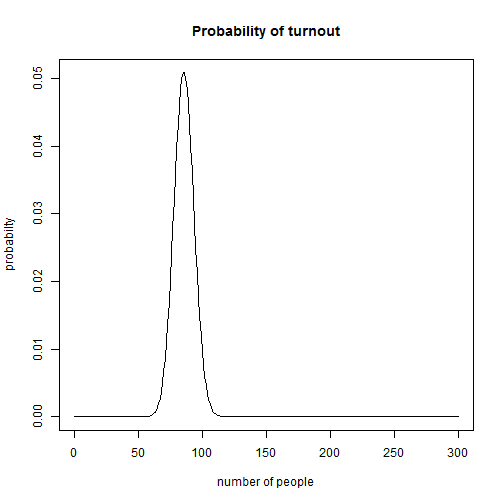

## Background

OBA is a gym soon to be opened in the Portland area. The owners are currently designing the facility. They want to know what capacity they should prepare for.

Suppose OBA has 300 members, each of which has equal likelihood of going to OBA on a specific day (this is a very strong assumption). We assume the likelihood is 2/7 (each member goes to OBA twice a week, then on any day of the week, the probablity is 2/7. We are assuming each day of the week has equal chance.)

Here we designed an application to help the oweners of OBA to decide how to prepare their facility to run efficiently.

--- 

## How many people will show up each day?

Again, suppose OBA has 300 members, any number of members could show up each day. The number of people who will show up follow a binomial distribution, with the probability for each outcome shown below.


 

---

## How should we prepare our facility? 

We don't want to under-prepare our facility, because we don't want members to complain; We don't want to over-prepare either, because it is a waste of resources. We estimate the maxiumal number of people who will show up 95% the times.


```r
CI=qbinom(0.95, size=300, prob=2/7)
```

It turns out although OBA has 300 members, 95% of the time, at most 99 will show up. 

---

## The application

we designed an application to help the oweners of OBA to decide how to prepare their facility to run efficiently.When ou input the total number of members OBA has, the application will give an estimation of the maximum number of people who will show up on any given day 95% of the time, given each of the members has equal likelihood of going to OBA on a specific day (2/7).

The applciation is located at:

https://linagao.shinyapps.io/turnout/
